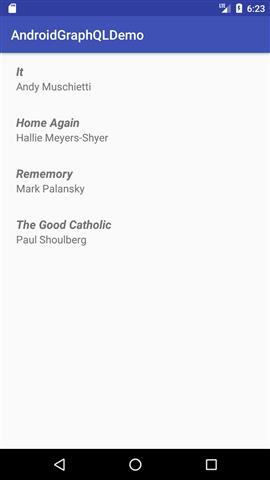

# Dumb GraphQL Android Demo
This is just to explore GraphQL on Android platform

**Used technologies:**

1. Graphcool as GraphQL server
2. Kotlin for the application part
3. OkHttp to communicate with Graphcool over HTTP
4. RxJava2 for thread management and reactive stuff

**What is does?**

Fetches some movie from using GraphQL and show them in a list

**What does it look like?**

**What to do next?**

Lots of things, like:
1. Proper error handling
2. Handling network state
3. Add unit tests
4. UI enhancement
5. Using a proper GraphQL client
6. Handle configuration changes (orientation et al.)
7. Add one here :)

**Caution** Do not take this demo as a serious work. 
I'm just exploring these stuffs, so what you see is the outcome of my learning process.
